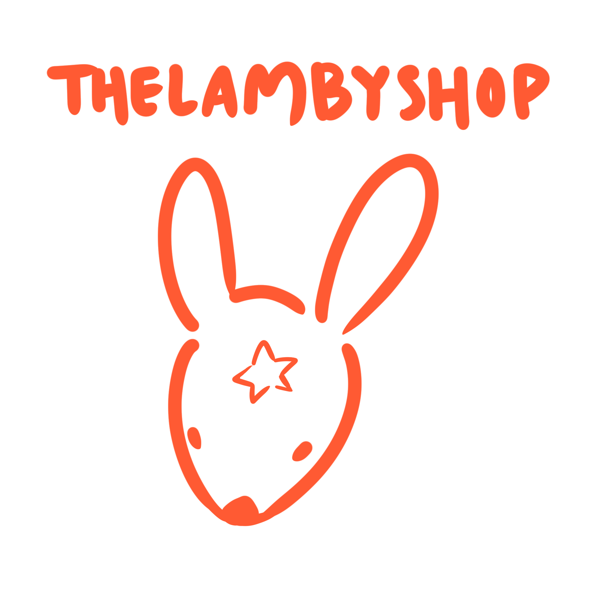

<!-- PROJECT LOGO -->
<br />
<div align="center">
  <a href="https://github.com/github_username/repo_name">
    
  </a>


<h3 align="center">The Lamby Shop</h3>

  <p align="center">
    An eccommerce website that sells crocheted items and accepts custom commissions
    <br />
    <a href="https://the-lamby-shop.vercel.app/">View Demo</a>
  </p>
</div>


<!-- TABLE OF CONTENTS -->
<details>
  <summary>Table of Contents</summary>
  <ol>
    <li><a href="#about-the-project">About The Project</a></li>
    <li><a href="#contributors">Contributors</a></li>
    <li><a href="#project-synopsis">Project Synopsis</a></li>
    <li><a href="#built-with">Built With</a></li>
    <li><a href="#getting-started">Getting Started</a>
      <ul>
        <li><a href="#prerequisites">Prerequisites</a></li>
        <li><a href="#installation">Installation</a></li>
      </ul>
    </li>
    <li><a href="#running">Running</a></li>
    <li><a href="#deployment">Deployment</a></li>
    <li><a href="#testing">Testing</a></li>
    <li><a href="#developer-instructions">Developer Instructions</a></li>
    <li><a href="#timeline">Timeline</a></li>
  </ol>
</details>


<!-- ABOUT THE PROJECT -->
## About The Project
 <br/>
The Lamby Shop is an ecommerce website that will sell handmade crotcheted items. Users will be able to buy items as well as make custom commisions. <br/>


Users will be greeted with an eye catching carousel that cycles through new and featured items that the admin can pick. Clicking "Shop Now" will take the user to the main catalog.


<div align="center">
  
  <br/>
  Users can learn more about our client and what her mission statement is. They can also find her various social media accounts here.

  <br/>
  Users can make custom commissions of our client. They will need to provide some information so that our client can get in contact with them, should she decide to accept the commission.

  <br/>
  The option to make an account will be available, however it is not required to have an account in order to purchase items from the shop. This is mainly used for additional admins of the shop.

  <br/>
  Users will be able to see the items they put in their shopping cart on one page. This will show how much each item costs and the total cost. While still in early development, the final page will look similar to this.

  <br/>
  <br/>
  Users can submit a ticket to get in contact with our client or any other admin. This will be the primary way users will be able to make inquiries about their ordered products.


   <br/>
  The NoSQL database will be able to store information on items, account information, and commisions. The owner account will be able to promote other accounts to Admin, which will allow those accounts to sell their own items on the website and accept custom commisions.
</div>


## Contributors
- Alex Souv: alexsouv@csus.edu
- Angelo Ventura: angeloventura@csus.edu
- Danny Phan: dannyphan2@csus.edu
- Henry Kong: henrykong@csus.edu
- Jonathan Medrano: jonathanmedrano@csus.edu
- Kevin Wong: kevinwong4@csus.edu
- Samuel Change: schang2@csus.edu
- Steven Ho: stevenho@csus.edu


<p align="right">(<a href="#table-of-contents">back to top</a>)</p>

## Project Synopsis

  In today's digital age, many individuals running side businesses face challenges in expanding their customer base beyond their local communities. This project aims to assist a seller of crochet products in overcoming these challenges by designing and developing a user-friendly website. The website will serve as a platform for showcasing the seller's handmade crochet items, allowing customers to browse and purchase products online. Additionally, the website will include an option for customers to request custom orders, providing a personalized shopping experience. The site will also feature the client's contact details, allowing customers to easily get in touch for inquiries or special requests. Our client aims to centralize most or all of her operations on this website and integrate this site into her business. Users can make accounts to manage their purchases and custom commissions. Our team hopes that this website will help our client grow and manage her side business.

### Built With

* [![React][React.js]][React-url]
* [![Tailwind][Tailwind.com]][Tailwind-url]
* [![AWS][AWS]][AWS-url]
* <a href="https://nodejs.org/en"> <a/>

<p align="right">(<a href="#table-of-contents">back to top</a>)</p>


<!-- GETTING STARTED -->
## Getting Started

To get started please begin by downloading the proper software listed in the Prerequisites.
Once those are downloaded, launch Vs Code, open a new terminal, then follow the installation instructions.
After you have done all of that, cd into the folder and run the command provided in Running to get your local branch running.

### Prerequisites

This is an example of how to list things you need to use the software and how to install them.
* Vs Code
  ```sh
  [-Vs Code](https://code.visualstudio.com/download)
  ```
* node.js
  ```sh
  [-node.js](https://nodejs.org/en/download)
  ```
* git
  ```sh
  [-git](https://git-scm.com/downloads)
  ```
* npm (if you already have node installed)
  ```sh
  npm install npm@latest -g
  ```

### Installation

1. Clone the repo
   ```sh
   git clone https://github.com/zzzkevon/the-lamby-shop
   ```
2. Install NPM packages
   ```sh
   npm install
   ```

### Running 
1. Run Command
   ```sh
   npm run start
   ```

<p align="right">(<a href="#table-of-contents">back to top</a>)</p>


<p align="right">(<a href="#table-of-contents">back to top</a>)</p>

## Deployment
Placeholder
1. Placeholder
2. Placeholder
3. Placeholder

<p align="right">(<a href="#table-of-contents">back to top</a>)</p>

## Testing
Placeholder
1. Account Creation
2. Account Login
3. Forgot Password
4. Account Management - Update Email
5. Account Management - Update Password
6. Commissions Section - Admin View
7. Commissions Section - Users View
8. Admin Dashboard - Product Management
9. Admin Dashboard - Message Subscribers
10. Subscribe
11. Home Page
12. Checkout

   
<p align="right">(<a href="#table-of-contents">back to top</a>)</p>

## Developer Instructions
Testing
1. Placeholder
2. Placeholder
3. Placeholder

<p align="right">(<a href="#table-of-contents">back to top</a>)</p>

<!-- MARKDOWN LINKS & IMAGES -->
<!-- https://www.markdownguide.org/basic-syntax/#reference-style-links -->
[contributors-shield]: https://img.shields.io/github/contributors/github_username/repo_name.svg?style=for-the-badge
[contributors-url]: https://github.com/github_username/repo_name/graphs/contributors
[forks-shield]: https://img.shields.io/github/forks/github_username/repo_name.svg?style=for-the-badge
[forks-url]: https://github.com/github_username/repo_name/network/members
[stars-shield]: https://img.shields.io/github/stars/github_username/repo_name.svg?style=for-the-badge
[stars-url]: https://github.com/github_username/repo_name/stargazers
[issues-shield]: https://img.shields.io/github/issues/github_username/repo_name.svg?style=for-the-badge
[issues-url]: https://github.com/github_username/repo_name/issues
[license-shield]: https://img.shields.io/github/license/github_username/repo_name.svg?style=for-the-badge
[license-url]: https://github.com/github_username/repo_name/blob/master/LICENSE.txt
[React.js]: https://img.shields.io/badge/React-20232A?style=for-the-badge&logo=react&logoColor=61DAFB
[React-url]: https://reactjs.org/
[Tailwind.com]: https://img.shields.io/badge/tailwindcss-%2338B2AC.svg?style=for-the-badge&logo=tailwind-css&logoColor=white
[Tailwind-url]: https://tailwindcss.com/
[AWS]: https://img.shields.io/badge/AWS-232F32?style=for-the-badge&logo=AmazonAWS&logoColor=white
[AWS-url]: https://aws.amazon.com/
